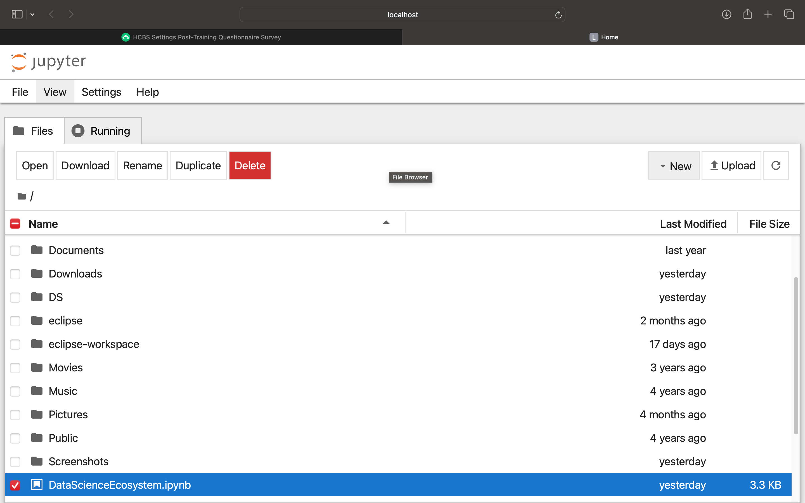
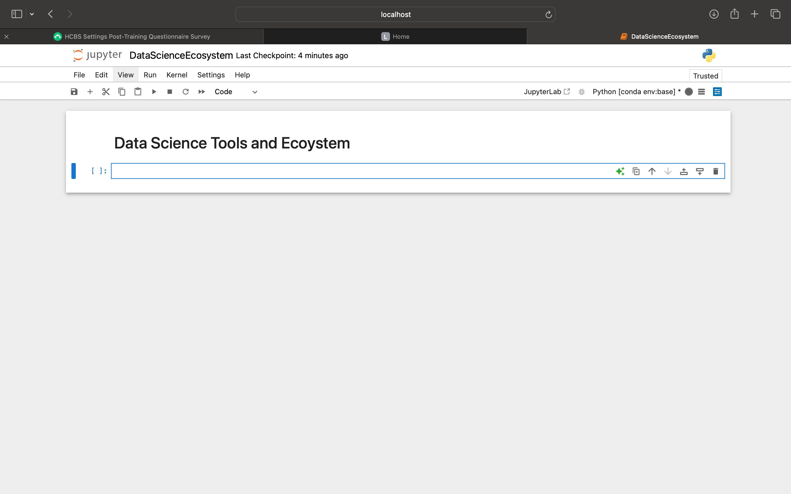
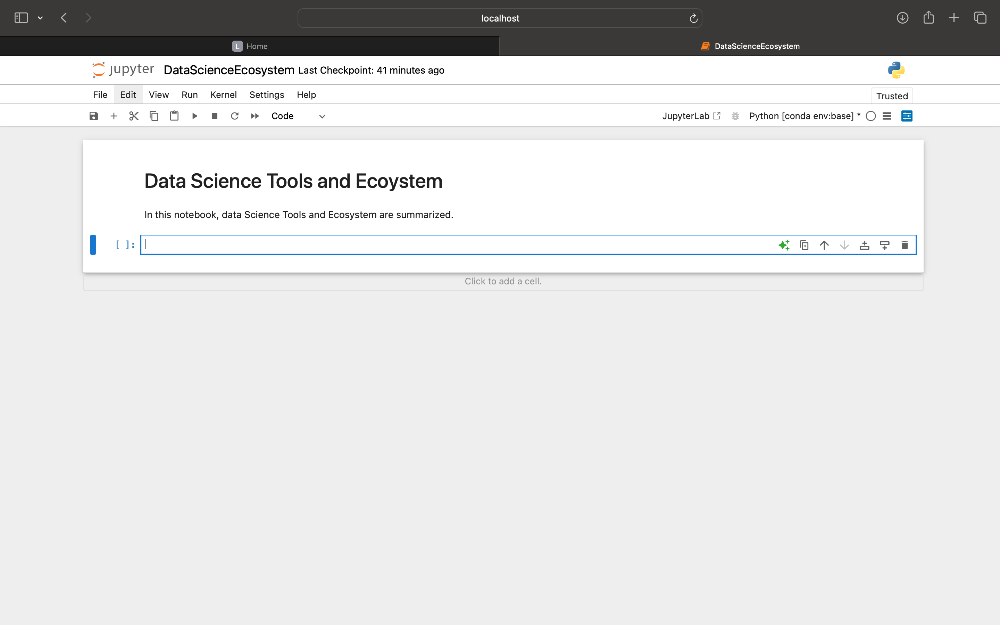
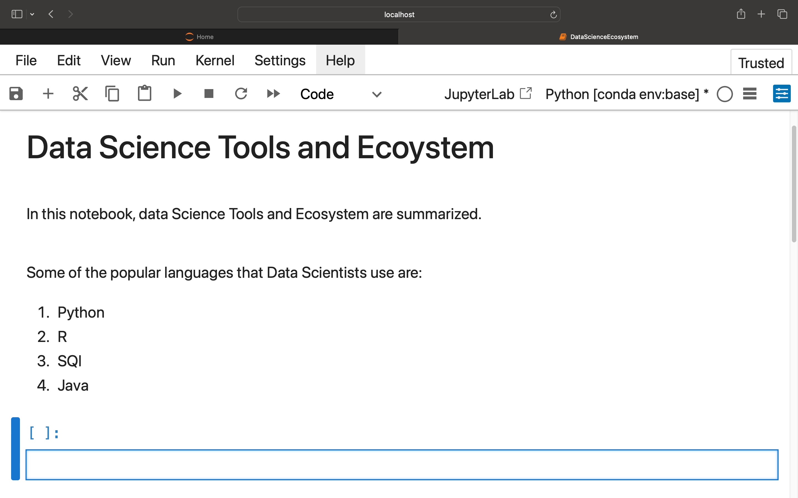
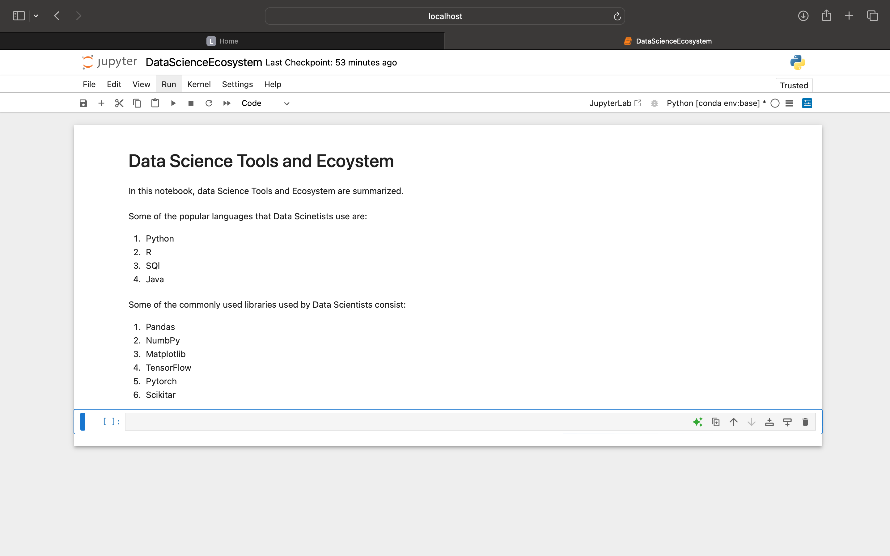
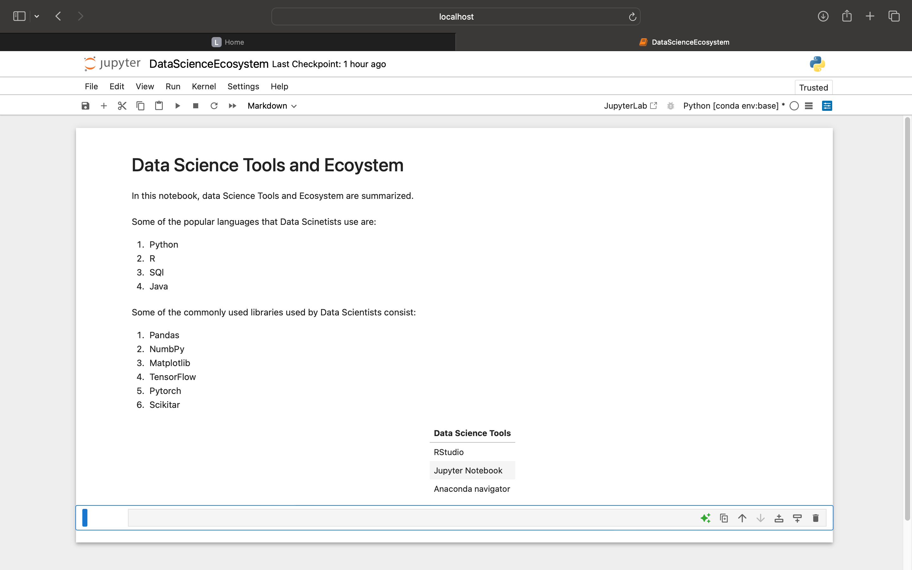
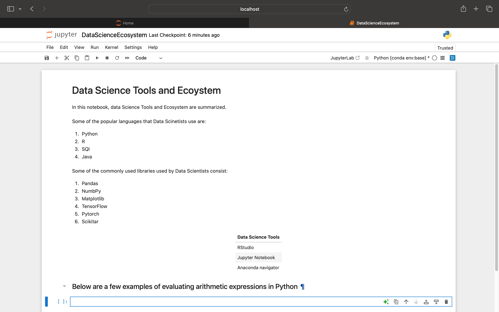

# Process of completing Jupyter notebook assignment

Step 1: I opened the DataScienceEcosystem file 

Step 2: Creates a title header 

Step 3: Created a introduction sentence 

Step 4: list of popular langauges 

Step 5: Libraries 

Step 6: Create table \

Step 7: Create arithmetic expression 

Step 8: 
